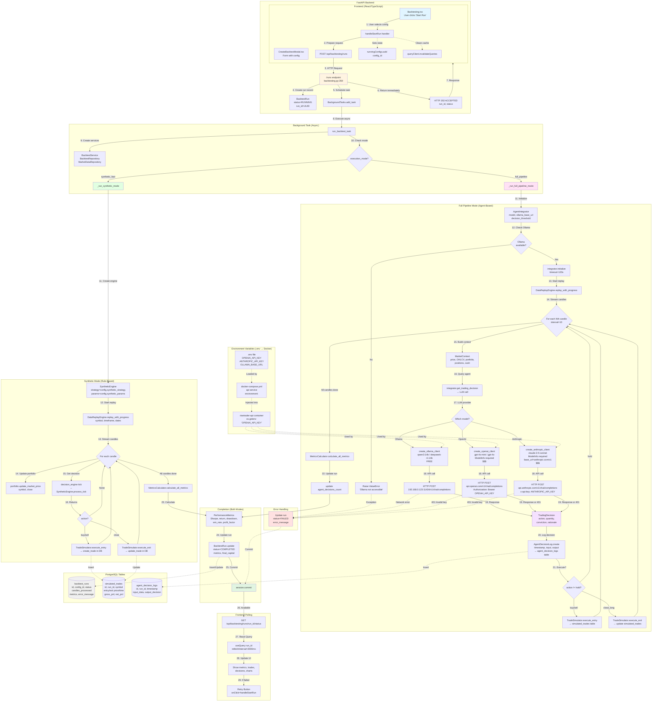

# Backtest Execution Flow Diagram

Complete flow of the RiseTrader backtesting system from UI trigger to completion.

## Complete System Flow



## Key Files and Methods

### Frontend
- **File**: `dashboard/src/pages/Backtesting.tsx`
  - **Method**: `handleStartRun(config_id: UUID, e: Event)`
  - **Input**: Configuration UUID
  - **Output**: API call to `/api/backtesting/runs`
  - **State**: Sets `runningConfigs`, invalidates queries

### API Layer
- **File**: `src/api/routes/backtesting.py`
  - **Endpoint**: `POST /runs` (line ~358)
  - **Method**: `run_backtest(request: RunBacktestRequest)`
  - **Input**: `config_id`, `timeframe`, `synthetic_strategy`, `synthetic_params`
  - **Output**: `BacktestRunStatusResponse` (HTTP 202)
  - **Side Effect**: Creates `BacktestRun` record, schedules background task
  - **⚠️ Critical**: Background task creates its own `AsyncSessionLocal()` session to avoid session lifecycle issues

### Backtest Service
- **File**: `src/services/backtesting/backtest_service.py`
  - **Method**: `run_backtest(config_id, timeframe, decision_engine, existing_run_id)` (line ~162)
  - **Input**: Configuration, optional decision engine
  - **Output**: Completed `BacktestRun` with metrics
  - **Orchestrates**: Data replay, portfolio, simulator, metrics

### Synthetic Mode
- **File**: `src/services/backtesting/backtest_service.py`
  - **Method**: `_run_synthetic_mode(run, config, portfolio, simulator)` (line ~289)
  - **Flow**:
    1. **If no decision_engine provided**: Reads `config.config_params` for `synthetic_strategy` and `synthetic_params`
    2. Creates `SyntheticEngine` from config params (supports `crude_oil_v3`, `ma_crossover`, `rsi`, etc.)
    3. Wraps engine in `decision_engine` callable
    4. Replays historical data via `DataReplayEngine`
    5. Calls `decision_engine(tick)` for each candle
    6. Executes trades via `TradeSimulator`
    7. Saves to `simulated_trades` table
  - **⚠️ Config Formats Supported**:
    - `{"synthetic_strategy": "crude_oil_v3", "synthetic_params": {...}}`
    - `{"strategy": "crude_oil_v3", "ema_fast": 8, ...}` (flat)

### Full Pipeline Mode
- **File**: `src/services/backtesting/backtest_service.py`
  - **Method**: `_run_full_pipeline_mode(run, config, portfolio, simulator)` (line ~435)
  - **Flow**:
    1. Creates `AgentIntegrator` with LLM config
    2. Checks Ollama availability (fails fast if unavailable)
    3. Replays data with interval (every 10 candles)
    4. Builds `MarketContext` from current state
    5. Calls `integrator.get_trading_decision(context)`
    6. Logs decision to `agent_decision_logs` table
    7. Executes trade if action != hold

### Agent Integrator
- **File**: `src/services/backtesting/agent_integrator.py`
  - **Method**: `get_trading_decision(market_context: MarketContext)`
  - **Input**: Market data + portfolio state
  - **Output**: `TradingDecision` (action, quantity, conviction, rationale)
  - **Side Effect**: Logs to `agent_decision_logs` via `_log_decision()`

### LLM Clients
- **OpenAI**: `src/agents/providers/openai_client.py`
  - **Method**: `create_openai_client(model, temperature, max_tokens, api_key)`
  - **Requires**: `OPENAI_API_KEY` env var, `ModelInfo` object
  - **Returns**: `OpenAIChatCompletionClient`

- **Anthropic**: `src/agents/providers/anthropic_client.py`
  - **Method**: `create_anthropic_client(model, temperature, max_tokens, api_key)`
  - **Requires**: `ANTHROPIC_API_KEY` env var, `ModelInfo` object
  - **Base URL**: `https://api.anthropic.com/v1`
  - **Returns**: `OpenAIChatCompletionClient` (OpenAI-compatible)

- **Ollama**: `src/agents/providers/ollama_client.py`
  - **Method**: `create_ollama_client(model, ollama_base_url, temperature)`
  - **Default URL**: `http://192.168.0.123:11434/v1`
  - **No API key required** (local/free)

### Database Models

#### Backtesting Tables
- **BacktestRun**: `src/database/models/backtest.py`
  - Fields: `id`, `config_id`, `status`, `candles_processed`, `metrics`, `error_message`

- **SimulatedTrade**: `src/database/models/simulated_trade.py`
  - Fields: `id`, `run_id`, `entry_price/time`, `exit_price/time`, `gross_pnl`, `net_pnl`

- **AgentDecisionLog**: `src/database/models/simulated_trade.py`
  - Table: `agent_decision_logs`
  - Purpose: Logs agent decisions during backtesting
  - Fields: `id`, `backtest_run_id` (FK), `timestamp`, `input_data`, `output_decision`, `agent_identifier`
  - Used by: Full Pipeline mode only

#### Live Trading Tables
- **DecisionLog**: `src/database/models/` (production)
  - Table: `decision_log`
  - Purpose: Logs agent decisions during live trading
  - Fields: `id`, `agent_id` (FK), `agent_type`, `strategy_team_id` (FK), `input_data`, `decision_data`, `was_executed`, `execution_result`, `pnl_impact`, `sharpe_impact`
  - Used by: Live trading agents only

## Variable Flow (Example: Agent Mode)

```
UI Click (config_id)
  → API Request {config_id, timeframe="M5", synthetic_strategy=null}
    → BacktestRun created {id=uuid4(), status=RUNNING}
      → Background task executes
        → Load config from DB → BacktestConfiguration object
          → execution_mode="full_pipeline"
            → AgentIntegrator(model="qwen3:14b", ollama_base_url="http://192.168.0.123:11434/v1")
              → Check Ollama: GET http://192.168.0.123:11434/api/tags
                → If 200: Continue
                → If error: Raise ValueError
              → integrator.initialize()
                → Create LLM client
              → For each 10th candle:
                → MarketContext {symbol="CrudeOIL", price=75.43, cash=10000, ...}
                  → integrator.get_trading_decision(context)
                    → Format prompt with context
                    → LLM API call:
                      - Ollama: POST http://192.168.0.123:11434/v1/chat/completions
                      - OpenAI: POST https://api.openai.com/v1/chat/completions (Header: Authorization: Bearer sk-...)
                      - Anthropic: POST https://api.anthropic.com/v1/chat/completions (Header: x-api-key: sk-ant-...)
                    → Response: {action="buy", quantity=1.0, conviction=0.75, rationale="..."}
                      → AgentDecisionLog.create {run_id, timestamp, input_data=context, output_decision=response}
                      → If action="buy":
                        → TradeSimulator.execute_entry(symbol, price, quantity)
                          → SimulatedTrade.create {run_id, entry_price, entry_timestamp, ...}
                      → Continue to next candle
              → After all candles:
                → MetricsCalculator.calculate_all_metrics(equity_curve, trades)
                  → PerformanceMetrics {sharpe=1.23, return_pct=15.4, ...}
                    → BacktestRun.update {status=COMPLETED, metrics=..., final_capital=...}
                      → session.commit()
                        → Available to polling: GET /runs/{run_id}/status
```

## Error Scenarios

### 1. Invalid OpenAI API Key
```
Environment: OPENAI_API_KEY=sk-invalid...
  → create_openai_client(api_key=sk-invalid...)
    → POST https://api.openai.com/v1/chat/completions
      → Response: 401 Unauthorized
        → Exception in integrator.get_trading_decision()
          → Logged but NOT raised (silent failure in old code)
          → Decision count = 0, backtest continues
          → Final result: 0 trades, 0 decisions, status=COMPLETED ❌
```

**Fix**: Proper API key from https://platform.openai.com/account/api-keys

### 2. Invalid Anthropic API Key
```
Environment: ANTHROPIC_API_KEY=sk-ant-invalid...
  → create_anthropic_client(api_key=sk-ant-invalid...)
    → POST https://api.anthropic.com/v1/chat/completions
      → Response: 401 Invalid Anthropic API Key
        → Exception in integrator.get_trading_decision()
          → Logged but NOT raised
          → Backtest continues with 0 decisions ❌
```

**Fix**: Valid API key from https://console.anthropic.com/settings/keys

### 3. Ollama Server Unreachable
```
Config: ollama_base_url="http://192.168.0.123:11434/v1"
  → _run_full_pipeline_mode()
    → httpx.get("http://192.168.0.123:11434/api/tags")
      → Timeout or Connection Refused
        → Raise ValueError("Ollama server not accessible")
          → BacktestRun.update {status=FAILED, error_message="Ollama server not accessible"}
          → UI shows: "Backtest Failed" with error message ✅
```

## Performance Characteristics

- **Synthetic Mode**: ~100-1000 candles/second (rule-based, no LLM, no decision logging)
- **Full Pipeline Mode (Ollama)**: ~0.2 candles/second (5s per LLM call, logs to `agent_decision_logs`)
- **Full Pipeline Mode (GPT-4o)**: ~0.1-0.3 candles/second (3-10s per API call + network, logs to `agent_decision_logs`)
- **Decision Interval**: Every 10 candles (configurable) to reduce LLM calls
- **Database Commits**: Every 5000 candles for progress updates
- **Progress Publishing**: Every 1000 candles to Redis (for SSE streaming)

**Note**: Live trading uses `decision_log` table instead of `agent_decision_logs`

## Cost Analysis (Full Pipeline Mode)

**Assumptions**: 30,000 candles, decision_interval=10 → 3,000 decisions

- **Ollama (qwen3:14b)**: $0 (free, local)
- **OpenAI (gpt-4o-mini)**: ~$0.15-0.30 per 1M tokens → ~$0.45-0.90 per run
- **Anthropic (claude-3-5-sonnet)**: ~$3 per 1M tokens → ~$9-18 per run
- **GPT-4o**: ~$5 per 1M tokens → ~$15-30 per run

**Recommendation**: Use Ollama for development/testing, proprietary models for production validation only.

---

## Recent Bug Fixes (2025-12-26)

### Fix 1: Background Task Session Lifecycle

**Problem**: Background tasks were using the API request's database session, which closes after HTTP response returns. This caused backtests to hang at 0 candles with silent failures.

**Symptom**: `status=running`, `candles_processed=0` forever, no error logs.

**Solution**: Background task now creates its own fresh session:
```python
async def run_backtest_task():
    async with AsyncSessionLocal() as task_session:  # Fresh session!
        task_service = BacktestService(session=task_session, ...)
        await task_service.run_backtest(...)
```

**File**: `src/api/routes/backtesting.py` (line ~393)

---

### Fix 2: Synthetic Engine Creation from config_params

**Problem**: `_run_synthetic_mode()` expected `decision_engine` to be passed in, but when using `config_params` (e.g., from UI), no engine was created. Backtests processed candles but generated 0 trades.

**Symptom**: `status=completed`, `candles_processed=50000`, `total_trades=0`.

**Solution**: `_run_synthetic_mode()` now reads `config.config_params` to create `SyntheticEngine` if no `decision_engine` provided:
```python
if decision_engine is None and config.config_params:
    synthetic_strategy = config.config_params.get("synthetic_strategy")
    if synthetic_strategy:
        synthetic_engine = SyntheticEngine(strategy=synthetic_strategy, ...)
        decision_engine = lambda tick: {...}  # Wrap engine
```

**File**: `src/services/backtesting/backtest_service.py` (line ~289)

---

### Fix 3: Background Task Error Handling

**Problem**: When background task crashed, run status stayed at `RUNNING` forever. Errors were logged but not persisted to database.

**Symptom**: `status=running` with error in logs, but UI shows "running" indefinitely.

**Solution**: Background task now updates run status to `FAILED` on exception:
```python
except Exception as e:
    await task_backtest_repo.update_run(
        run_id=run_id,
        update_data={
            "status": DBRunStatus.FAILED,
            "error_message": str(e),
        }
    )
    await task_session.commit()
```

**File**: `src/api/routes/backtesting.py` (line ~470)
